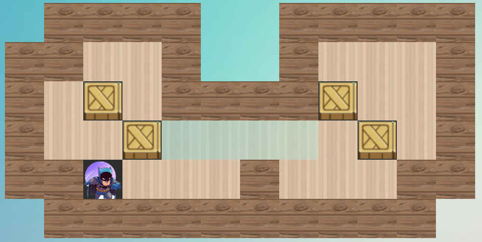

<h1 align="center">Sokoban Games</h1>
It is a project of CITS3403 of The University of Western Australia in 2022 
and is a web version of a simple [Sobokan Games](). 
As shown in the picture below.
<p align="center">
    
</p>

## Directory
* [Requirements](#requirements)
    * [Required Languages](#required-packages)
    * [Required Packages](#required-packages)
* [Launch From Local Host](#getting-started)
    * [Gain Project file](#gain-Project-file)
    * [Steps](#steps)
* [Train of Thought](#train-of-thought)
    * [Level Maps](#level-maps)
    * [Movements](#movements)
    * [Score Scale](#score-scale)
* [Update and Vet Levels](#update-and-vet-levels)
* [Testings](#testing)
    * [Log in, Register and Log Out](#score-scale)
    * [Test Coverage](#score-scale)
    * [Gaming Experience and Web Page Buttons](#experience)
* * *

## Requirements
### Required Languages
- HTML5, CSS3 and JavaScript
- Python
### Required Packages
`alembic`==1.7.7, `click`==8.1.3, `dnspytho`n==2.2.1, `email-validator`==1.2.1, `Flask`==2.1.2, `Flask-Login`==0.6.1, `Flask-Migrate`==3.1.0, `Flask-SQLAlchemy`==2.5.1, `Flask-WTF`==1.0.1, `greenlet`==1.1.2, `idna`==3.3, `importlib-metadata`==4.11.4, `itsdangerous`==2.1.2, `Jinja2`==3.1.2, `Mako`==1.2.0, `MarkupSafe`==2.1.1, `python-dotenv`==0.20.0, `SQLAlchemy`==1.4.36, `Werkzeug`==2.1.2, `WTForms`==3.0.1, `zipp`==3.8.0

## Launch From Local Host
### Gain Project file
- Download from [GitHub](https://github.com/22856226/CITS3403project.git) and then get a file named CITS3403project.
or
- Obtain the CITS3403project file package by other ways.
### Steps
1. Find the route to the CITS3403 file and enter it on the local host.
2. Run the following command to bulid a virtual Python environment -- ***__virtualEnv__***:
- For Linux / OS X:
```
$ sudo apt-get install virtualenv
```
For Windows:
```
$ pip install virtualenv
```
3. If the terminal environment is `(base)`, run the following command to activate the virtual environment `(venv)`:
- For Linux / OS X:
```
$ source venv/bin/activate
```
- For Windows:
```
$ source venv\scripts\activate
```
- Also, you can exit virtual environment using the following command:
```
$ deactivate
```
4. Run the following command to install Flask in this environment:
```
$ pip install Flask
```
5. Use the following command to install third-party packages required by the project：
```
$ pip install -Ur requirements.txt
```
6. Use the following command and visit 'http://127.0.0.1:5000':
```
$ export Flask_APP=microblog.py
$ flask fun
```
__Now, you can access the project from the local host.__

## Train of Thought
### Level Maps
Level 1 of the Sokoban Games will be used as an example.<br/>
**Picture form：**
<p align="center">
    
</p>

**The input form in the python code：**
```
[0,3,3,3,3,0,0,3,3,3,3,3,
3,3,2,2,3,0,0,3,2,2,2,3,
3,2,4,2,3,3,3,3,4,2,2,3,
3,2,2,4,1,1,1,1,2,4,2,3,
3,3,2,2,2,2,3,2,2,2,3,3,
0,3,3,3,3,3,3,3,3,3,3,0]
```
As shown above, the rules of the level maps are `0` is an unreachable area, `1` is a target position(where to be pushed), 
`2` is a normal path (walkable), `3` is a wall, and `4` is a chest.

### Movements
To get through the level, player need to push all the chests into all the light colored places on the level map. As shown below picture.  
At the same time, the number of steps recorded is compared to other players based on the score scale.
<p align="center">
    
</p>

### Score Scale
1. The number of steps per level will be roughly divided into three scoring levels, with the fewer steps the higher the score. 
2. The more difficult the level is, the higher the score level will be. </br>
* For example, in level 1, the score is 40 for steps less than 60, 30 for steps greater than 60 and less than 80, and 20 for all others. Correspondingly, in level 3, the score is 60 for steps less than 140, 50 for steps greater than 140 and less than 170, and 40 for other times.</br>
* Of course, you can change the detailed rules of scoring by modifying the `win` function in the `index.js`.
However, you have to follow the two above rules.

## Update and Vet Levels
1. Firstly, go to the `src` file in CITS3403 file and open `index.js`.
2. Add the new level map that follows the map rules in `maps` variable, which shown below:
<p align="center">
    
</p>

3. Also, add the folloing command to the `index.js` and you only need to change the `x` variable,
which is the number of level you want to add:
```
$("#levelx").click(function(){
    level=x-1;
    target = box_number[level]; // the number of boxes
    position = initial_position[level];// first position of the batman
    steps=[];
    record=[];
    movetimes=0;
    times();
    create(); // render the map 
})
```
4. Then, create a new scoring rule for the new level, as detailed in the [Score Scale](#score-scale) section.
5. Finally, save the `index.js` and re-execute all commands, and you can see the changes on the Web page.

## Testings
To execute the tests, simply execute `teste.py` in the CITS3403 file.
### Log in, Register and Log Out
1. Test used correct username and password to login for `login()`.
2. Test whether player can log out for `logout()`.
3. Test used incorrect username but correct password (or correct username but incorrect password) to login for `login()`.
4. Test whether player can register a account for `register()`.
5. Test used blank input of username or password for `register()`.
### Test Coverage
1. Use `Coverage.py` to test the coverage of project. Firstly, use following command to install it and then run `tests.py`:
```
$ pipenv install coverage --dev
$ coverage run --source=app tests.py
```
### Gaming Experience and Web Page Buttons
- This was tested through user experience in the web page that launched primarily from the [local host](#getting-started).
